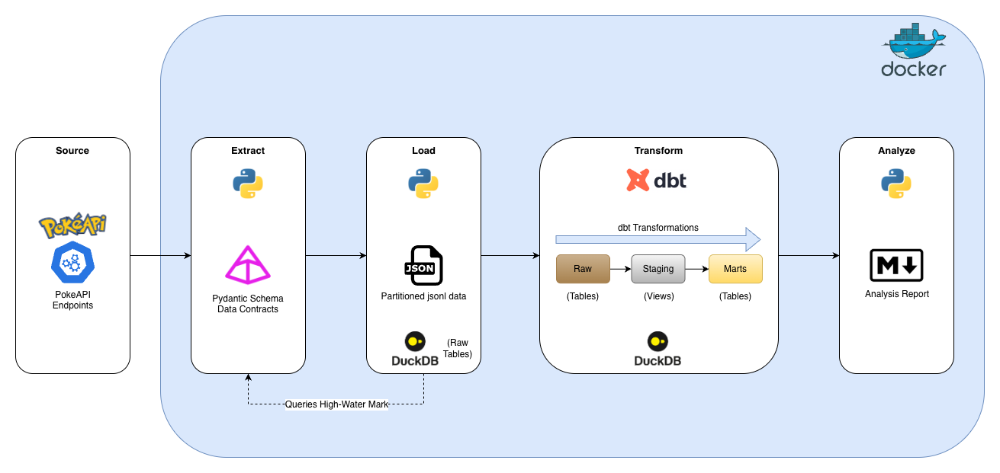

# Pokémon Data Warehouse

This repository implements a production-grade, idempotent ELT pipeline.<br>
It extracts from the PokéAPI, stages payloads in a local partitioned Data Lake, and models a dimensional Data Warehouse using DuckDB and dbt.

The architecture is built around three core principles: **contract-driven ingestion**, **compute pushdown**, and **zero-copy staging**.

## Tech Stack & Tooling Rationale

* **Python:** Primary language used for Extract, Load and Analyze steps.
* **Pydantic:** Enforces data contracts at the edge, validating schemas and dropping bad data before it hits the data lake.
* **DuckDB:** Fast and in-process OLAP engine, chosen for its ability to push down compute directly onto raw JSON without a heavy cluster.
* **dbt:** Manages the SQL transformation layer, enabling modular dimensional modeling, lineage, and built-in testing.
* **Docker & Make:** Guarantees a reproducible, isolated environment and abstracts execution into simple `make` commands.

## Prerequisites

Before running the pipeline, ensure you have the following installed on your system. By containerizing the environment, you do not need to install Python, dbt, or DuckDB locally.

* **Docker & Docker Compose:** The entire ELT pipeline runs inside an isolated container environment to guarantee reproducibility.
  * *Mac/Windows:* Install [Docker Desktop](https://www.docker.com/products/docker-desktop/).
  * *Linux:* Install Docker Engine and the Docker Compose plugin via your distribution's package manager.
* **Make:** Used to execute the pipeline commands seamlessly via the provided `Makefile`.
  * *Mac:* Usually pre-installed with Xcode Command Line Tools, or available via Homebrew (`brew install make`).
  * *Linux:* Install via your package manager (e.g., `sudo apt-get install make`).
  * *Windows:* Best utilized via Windows Subsystem for Linux (WSL2) or Git Bash.
* **Git:** To clone this repository.

## Execution

The pipeline is fully containerized and orchestrated via GNU Make. 

```bash
# Execute the end-to-end pipeline (Extract -> Load -> Transform -> Analyze)
make run

# View the Core 3 Analytics output
cat data/reports/analytics_report.md

# Teardown local state (Lake + DB)
make clean
```

## Architecture & Design Decisions


### Core 1 - Ingestion

API extraction is typically the most brittle part of an ELT pipeline. I prioritized state management, schema validation at the edge, and compute pushdown for loading.

* **Stateful Incremental Loads:** Instead of blind full-refreshes, the Python worker queries DuckDB for a high-water mark (existing IDs). If run daily, it only fetches net-new Pokémon, minimizing API latency and compute.
* **Concurrency:** Extraction is I/O bound. The script uses a `ThreadPoolExecutor` to fetch detail records and dynamically resolve dependencies (Types, Abilities) in memory.
* **Data Contracts (`src/schemas.py`):** I use pydantic to enforce a late-binding schema. We validate the specific facts the warehouse needs (e.g., stats arrays, types) and let the rest of the payload pass through losslessly to the Lake. Bad data is dropped and logged before it reaches storage.
* **Compute Pushdown (Loading):** Rather than parsing JSON iteratively in Python, the pipeline pushes the compute down to DuckDB’s engine via `read_json_objects`.
* **Lineage & Delta Loads:** Raw JSONs are sunk into `.jsonl` files partitioned by year/month/day. By leveraging DuckDB's `filename=true` parameter, we map every row to its exact source file. This allows DuckDB to perform an append-only delta-load (ignoring previously ingested files) without a separate state backend.

### Core 2 - Data Modelling


* **The Storage Tax Tradeoff:** In modern OLAP, materializing 1:1 staging tables wastes I/O and disk space. I explicitly defined the dbt `stg_` layer as Views. They handle JSON unnesting on the fly, allowing DuckDB to stream data from Raw directly to Marts in memory.
* **Dimensional Model:** Modeled as a Star Schema to support BI workloads.
    * **Dimensions:** `dim_pokemon`, `dim_type`, and `dim_ability` hold the descriptive attributes.
    * **Grain:** `fact_pokemon_stats` is strictly one row per Pokémon.
    * **Bridges:** To handle the many-to-many relationships without fanning out the fact grain, I implemented `bridge_pokemon_type` (which preserves the primary/secondary slot order) and `bridge_pokemon_ability`.
    * **Aggregations:** Built `agg_type_stats` to provide pre-aggregated average stats and Pokémon counts per type.

### Core 3 - Analysis

Using the modeled data, the pipeline answers the core analytical questions. 

Instead of treating this as a manual query exercise, I automated it: `src/analyze.py` queries the DuckDB marts and dynamically generates a markdown output. 
* **You can view the final output in:** `data/reports/analytics_report.md`

## Core 4 - Data Quality & Production Thinking

### Part A - Data quality checks

Quality is handled via defense-in-depth, catching errors at both the boundary and the warehouse level:

* **Edge:** Pydantic drops unexpected data types during API extraction.
* **Referential Integrity:** dbt relationship tests guarantee every row in the bridge tables maps to a valid `pokemon_id` and `type_id`.
* **Nullity:** Primary keys and critical dimensions are asserted `not_null` in `marts.yml`.
* **Domain Logic:** I wrote a custom dbt test (`tests/test_stats_within_bounds.sql`) to assert that no base stat violates the 1–255 integer bound.

### Part B — Production sketch

While this pipeline currently handles a fixed set of 151 Pokémon, transitioning to a production environment requires a defensive, "Day 2" operational mindset. If deployed for daily updates:

* **Orchestration & Scheduling:** I would deploy the Python and dbt execution blocks as a Directed Acyclic Graph (DAG) in an orchestrator like Airflow, scheduled via cron (e.g., 02:00 UTC daily). 
* **Idempotent Incremental Extraction:** The pipeline's incremental watermark design natively handles both scale and restarts. If a run fails halfway, restarting it simply picks up from the last successfully written ID. If 500 new Pokémon drop tomorrow, the worker diffs the API against the DuckDB state and only processes those 500, keeping compute costs flat.
* **Automated Schema Evolution:** The architecture explicitly resolves dependencies dynamically. If the API introduces a brand new "Cosmic" type, no code changes are required. The new type flows into the Lake, gets unnested by the dbt bridge view, and automatically populates `dim_type`.
* **Proactive Observability vs. Silent Failures:** Silent failures (e.g., an API returns a 200 OK but an empty payload) destroy data trust. To combat this:
    * I would configure **dbt source freshness checks** on the raw tables to catch stalled ingestion before downstream models run.
    * I would implement **anomaly detection** (using tools like `dbt-expectations`) to trigger a PagerDuty alert if the daily extracted row count drops statistically below the 7-day moving average, catching partial API outages.

## AI Usage

I leverage AI as a force multiplier for execution, allowing me to focus my time on high-value architecture, dimensional modeling, and pipeline resilience. All design decisions, tradeoffs, and structural patterns in this repository are my own. 

For this project, I used LLMs to accelerate boilerplate creation:
* **dbt Development Speed:** Rapidly scaffolding `staging.yml` and `marts.yml` files, generating documentation blocks, and writing boilerplate SQL for initial staging views.
* **Schema Generation:** Passing raw JSON payloads from the PokeAPI into the LLM to instantly generate the foundational Pydantic models.
* **Syntax Optimization:** Refining the specific DuckDB syntax for optimal JSON ingestion.
